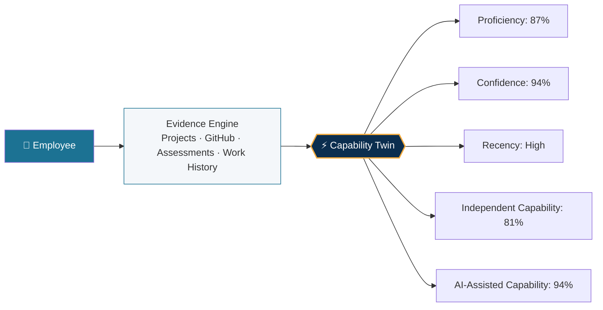
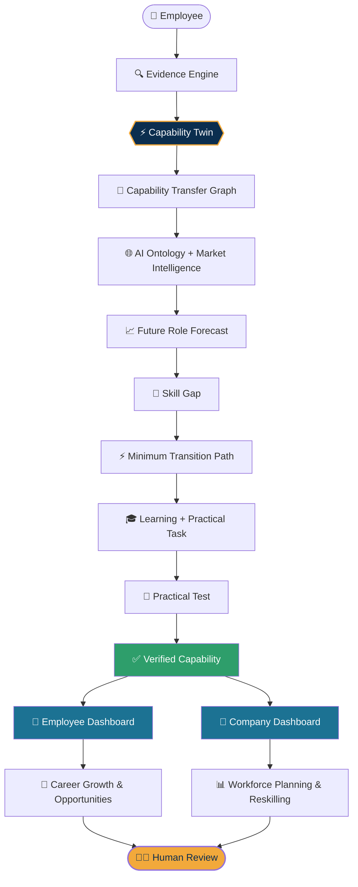
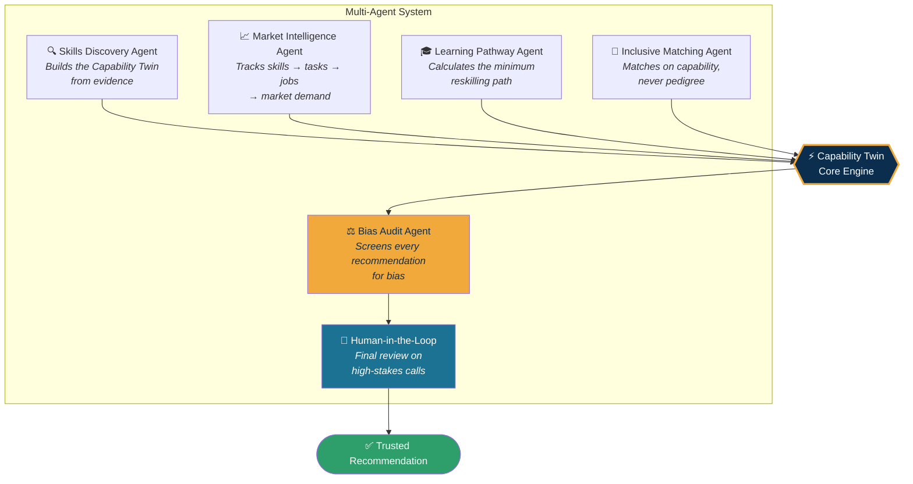
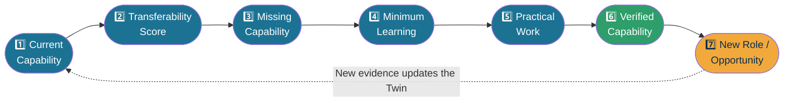
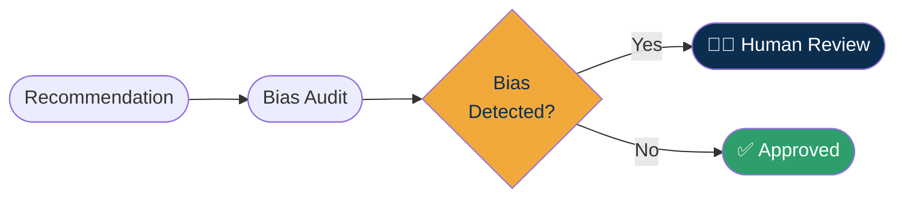

<div align="center">

# 🌐 Access-Hire

### An Adaptive Capability Twin for an Inclusive Workforce

*AI is rewriting who gets to work. We make sure it rewrites the rules fairly.*

[](https://github.com/Devengoyal885/Access-Hire)
[](#-team-starcoders)
[](#-license)
[](#)

[Problem](#-the-problem) · [Solution](#-our-solution) · [Architecture](#-system-architecture) · [Dashboards](#-product-walkthrough) · [Tech Stack](#-tech-stack) · [Team](#-team-starcoders)

</div>

---

## 📌 Table of Contents

- [The Problem](#-the-problem)
- [Our Solution](#-our-solution)
- [Core Concept — The Capability Twin](#-core-concept--the-capability-twin)
- [System Architecture](#-system-architecture)
- [Multi-Agent Ecosystem](#-multi-agent-ecosystem)
- [Evidence-to-Transition Loop](#-evidence-to-transition-loop)
- [Bias Audit & Inclusion Layer](#-bias-audit--inclusion-layer)
- [Product Walkthrough](#-product-walkthrough)
- [Competitive Landscape](#-competitive-landscape)
- [Tech Stack](#-tech-stack)
- [Getting Started](#-getting-started)
- [Our Track Record](#-our-track-record)
- [Team StarCoders](#-team-starcoders)
- [License](#-license)

---

## 🧩 The Problem

> **"The challenge is no longer *will AI take jobs* — it's *who will AI leave behind.*"**

AI is reshaping global employment and creating a **$5.5T global skills gap**. Traditional workforce systems still filter people by:

`Job Title` · `Resume Keywords` · `Degree` · `Certifications` · `Years of Experience`

This creates two blind spots:

| 👤 For Employees | 🏢 For Companies |
|---|---|
| Someone may already have the skills for a new role — but gets rejected because their job title, resume, or degree doesn't match. Real capability stays invisible. | Companies only ask *"what job does this person hold?"* instead of *"what can they do, what's missing, and what could they become?"* — so they hire externally instead of reskilling. |

---

## 💡 Our Solution

**Access-Hire** asks a better question:

> ### "What can this person actually do — and what could they become?"

We built an AI-powered workforce platform with two connected users:

- 👤 **Employee** — *"What can I do, what can I become, and how do I get there?"*
- 🏢 **Company / HR** — *"What capabilities do my employees have, what will we need, and who can I reskill instead of replacing?"*

```
Understand → Transfer → Forecast → Reskill → Verify → Opportunity
```

---

## 🧬 Core Concept — The Capability Twin

Instead of a static label like `Python = Expert`, every person gets a **living, evidence-backed Capability Twin**.



The system knows **what someone can do + how well + where + the evidence proving it** — not just a resume keyword match.

---

## 🏗 System Architecture

The full pipeline — from raw evidence to a verified new opportunity — with governance built in at every high-stakes step.



---

## 🤖 Multi-Agent Ecosystem

Six specialized agents share one Capability Twin — built directly to the SAP Hackfest brief for a **fair, skills-first workforce platform**.



---

## 🔁 Evidence-to-Transition Loop

We don't just *recommend* learning — we **verify** whether someone actually became capable.



> 💬 *"Learning ≠ readiness. Performance on real, practical work is what unlocks the next opportunity."*

---

## ⚖️ Bias Audit & Inclusion Layer

Fairness is architecture, not a feature.

| ❌ We ignore | ✅ We weigh instead |
|---|---|
| College name | Demonstrated capability |
| Location | Transferable capability |
| Career gap | Verified evidence |
| Previous job title alone | Growth potential |
| Formal credential alone | Accessibility & flexibility needs |



The AI recommends. **Humans make the final high-stakes decisions — always.**

---

## 📊 Product Walkthrough

<table>
<tr>
<td width="50%" valign="top">

### 👤 Employee Dashboard

```
MY CAPABILITY TWIN
────────────────────
Python              87%  ████████▋
Backend             81%  ████████
SQL                 82%  ████████
Cloud                64%  ██████▍
AI                    58%  █████▊

FUTURE OPPORTUNITIES
────────────────────
AI Operations        74%
AI Engineer            71%
Cloud Engineer     68%

RECOMMENDED GROWTH
────────────────────
▸ AI Evaluation
▸ Agent Orchestration
▸ Cloud AI Deployment
```

</td>
<td width="50%" valign="top">

### 🏢 Company Workforce Dashboard

```
COMPANY WORKFORCE — 10,000 EMPLOYEES
────────────────────
AI                    42%  ████▌
Cloud                58%  ██████
Data                  61%  ██████▎
Cybersecurity     37%  ████

WORKFORCE GAP
────────────────────
AI Engineering        1,240
AI Security                680
Cloud AI                     520

"We don't need to hire 1,240 people
— we can reskill from within."
```

</td>
</tr>
</table>

---

## 🥊 Competitive Landscape

| Platform | Their Strongest Point | Where Access-Hire Goes Further |
|---|---|---|
| **Eightfold AI** | Talent intelligence & trajectory prediction | Prove readiness through practical work, not just inference |
| **Workday Skills Cloud** | Deep HCM & employee data integration | Add a transition-readiness layer on top of the skills graph |
| **SAP Talent Intelligence Hub** | Native SAP HCM ecosystem | Complement SAP — extend skills into verified transitions |
| **Beamery** | Workforce digital twin & task intelligence | Make it employee-transition-centric with proof, not just data |
| **Gloat** | Opportunity marketplace matching | Be the readiness engine that runs *before* marketplace matching |
| **Phenom** | Skills ontology & career pathing | Make transitions measurable and experimentally verified |

---

## 🛠 Tech Stack

<div align="center">


</div>

> ℹ️ Update the badges above to match the exact stack used in this repository (backend framework, database, ML/AI libraries, etc.) as the implementation evolves.

---

## 🚀 Getting Started

```bash
# 1. Clone the repository
git clone https://github.com/Devengoyal885/Access-Hire.git
cd Access-Hire

# 2. Install dependencies
npm install

# 3. Set up environment variables
cp .env.example .env.local
# Fill in the required API keys / config values

# 4. Run the development server
npm run dev
```

The app should now be running at `http://localhost:3000` 🎉

---

## 🏆 Our Track Record

StarCoders doesn't just pitch — we ship. Access-Hire is our latest build.

| Project | Description | Link |
|---|---|---|
| **CodeXPath** | An AI-assisted platform for navigating and understanding code paths | [code-x-path.vercel.app](https://code-x-path.vercel.app/) |
| **Opportunity Radar AI** | Discovers and surfaces relevant opportunities through an AI-driven dashboard | [opportunity-radar-ai.netlify.app](https://opportunity-radar-ai.netlify.app/dashboard) |
| **Access-Hire** | Adaptive Capability Twin for an Inclusive Workforce *(this project)* | [github.com/Devengoyal885/Access-Hire](https://github.com/Devengoyal885/Access-Hire) |

---

## 👨‍💻 Team StarCoders

<div align="center">

| Avatar | Name | GitHub | LinkedIn |
|:---:|---|:---:|:---:|
| 🧑‍💻 | **Deven Goyal** | [@Devengoyal885](https://github.com/Devengoyal885) | [LinkedIn](https://www.linkedin.com/in/deven-goyal/) |
| 🧑‍💻 | **Gurleen Kaur Bedi** | [@Gurleen12star](https://github.com/Gurleen12star) | [LinkedIn](https://www.linkedin.com/in/gurleen-kaur-bedi-296305314/) |
| 🧑‍💻 | **Ridhi Bansal** | [@RidhiiBansal](https://github.com/RidhiiBansal) | [LinkedIn](https://www.linkedin.com/in/ridhi-bansal-42a700317/) |
| 🧑‍💻 | **Bani Kaur** | [@banikaur22](https://github.com/banikaur22) | [LinkedIn](https://www.linkedin.com/in/bani-kaur-3b7283217/) |
| 🧑‍💻 | **Aryan Yadav** | [@aryanrao](https://github.com/aryanrao) | [LinkedIn](https://www.linkedin.com/in/aryanyadav05/) |

*Full-stack builders — from AI product design to shipped, live applications.*

</div>

---

## 📄 License

This project is licensed under the **MIT License** — see the [LICENSE](LICENSE) file for details.

---

<div align="center">

### 🌟 Let's build the fair future of work — together.

**Team StarCoders** · SAP Hackfest 2026 · Theme 2: Inclusive Workforce

⭐ If you like this project, consider giving it a star on [GitHub](https://github.com/Devengoyal885/Access-Hire)!

</div>
